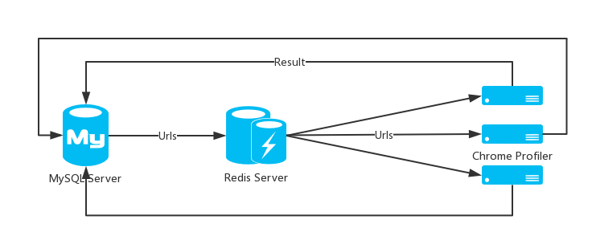
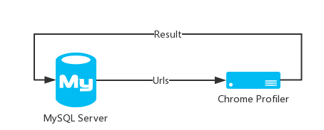

## Prerequisites

- MySQL Community Server
- Redis server
- Node.js >= v8.0.0 with npm >= v5.0.0

## Design

There are three parts in our design:

1. MySQL Server - Store the data
2. Redis Server - Cache the data
3. Chrome Profiler - Fetch data from the Redis Server, and write back to the database



If you just want test it, you can change our design like this(maybe you need rewrite some code):



## Database

1. Start your MySQL server
2. Create an empty MySQL database
3. Modify the file named `config.js` within this dir:

```javascript
exports.dbConfig = {
    host: '127.0.0.1',
    port: 3306,
    user: 'root',
    password: 'password',
    database: 'tracer'
};
```
## Commands

```
# install dependencies
npm install

## Get help
node app.js -h

## simply start
node app.js -P port -N number of tabs
node timespace -P port -N number of tabs
```